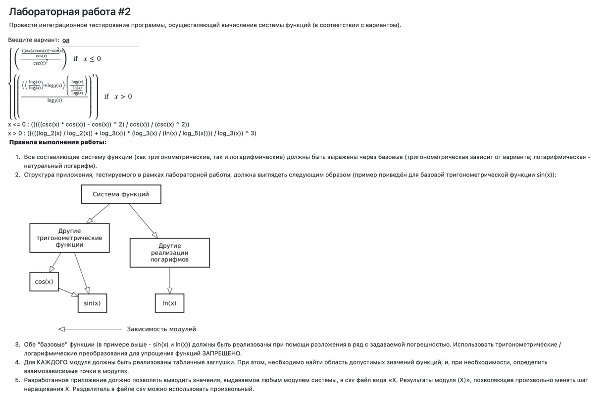

# Лабораторная работа 2

---

### Вариант `98`

> Махмудова Мария Александровна 290102 \
> Козырева Эмилия Владимировна 394031 \
> P3324

---

### Задание

<table>
  <tr>
     
  </tr>
</table>

### Порядок выполнения работы:

Разработать приложение, руководствуясь приведёнными выше правилами.
С помощью JUNIT5 разработать тестовое покрытие системы функций, проведя анализ эквивалентности и учитывая особенности системы функций. Для анализа особенностей системы функций и составляющих ее частей можно использовать сайт https://www.wolframalpha.com/.
Собрать приложение, состоящее из заглушек. Провести интеграцию приложения по 1 модулю, с обоснованием стратегии интеграции, проведением интеграционных тестов и контролем тестового покрытия системы функций.

### Отчёт по работе должен содержать:

Текст задания, систему функций.
UML-диаграмму классов разработанного приложения.
Описание тестового покрытия с обоснованием его выбора.
Графики, построенные csv-выгрузкам, полученным в процессе интеграции приложения.
Выводы по работе.

### Вопросы к защите лабораторной работы:

Цели и задачи интеграционного тестирования. Расположение фазы интеграционного тестирования в последовательности тестов; предшествующие и последующие виды тестирования ПО.
Алгоритм интеграционного тестирования.
Концепции и подходы, используемые при реализации интеграционного тестирования.
Программные продукты, используемые для реализации интеграционного тестирования. Использование JUnit для интеграционных тестов.
Автоматизация интеграционных тестов. ПО, используемое для автоматизации интеграционного тестирования.

---